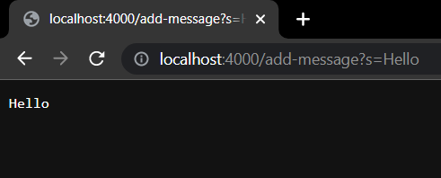
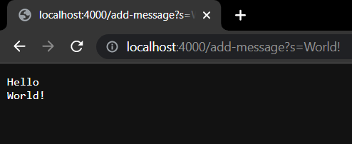
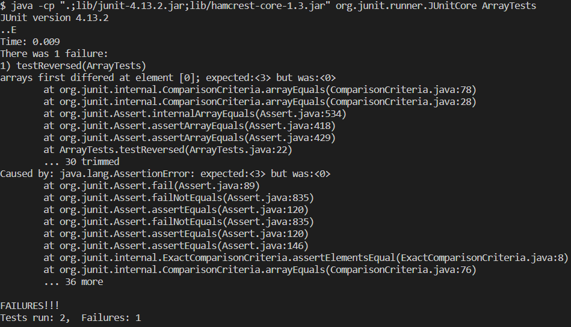

## StringServer.java 

<details>
  <summary>Click to view code!</summary>
<br/>

```java
import java.io.IOException;
import java.io.OutputStream;
import java.net.InetSocketAddress;
import java.net.URI;

import com.sun.net.httpserver.HttpExchange;
import com.sun.net.httpserver.HttpHandler;
import com.sun.net.httpserver.HttpServer;

import java.io.IOException;
import java.net.URI;

class StringHandler implements URLHandler {
    // String that stores the messages added
    String str = "";

    public String handleRequest(URI url) {
        if (url.getPath().equals("/")) 
        {
            return "No messages to add";
        } 
        else if (url.getPath().equals("/add-message"))
        {
            String[] parameters = url.getQuery().split("=");
            if (parameters[0].equals("s"))
                str += parameters[1] + "\n";
                return String.format("%s", str);
        }
        return "Error 404 not found";
    }
}

class StringServer {
    public static void main(String[] args) throws IOException {
        if(args.length == 0){
            System.out.println("Missing port number! Try any number between 1024 to 49151");
            return;
        }

        int port = Integer.parseInt(args[0]);

        Server.start(port, new StringHandler());
    }
}
```

</details>

<details>
  <summary>Click to view code!</summary>  
  <br> 
  
	

 The following combination of methods and arguments are called in the given order:
  
  `main(["4000"]) ` 
  
  * `Integer.parseInt("4000")` 
  
  * `Server.start(4000, new StringHandler())` 
  
  `handleRequest(new URI("localhost:4000/add-message?s=Hello"))`
  
  * `url.getPath().equals("/") //evaluates to false`
  
  * `url.getPath().equals("/add-message") //evaluates to true` 

  <br> <br>
  
	
  
   Since the server is already running and `main()` method already called, any url update is simply rerouted to the `handleRequest()` method
  
  `handleRequest(new URI("localhost:4000/add-message?s=World!"))`
  
  * `url.getPath().equals("/") //evaluates to false`
  
  * `url.getPath().equals("/add-message") //evaluates to true`

<br>
Once the server is up and running, any *viable* update to the url will append the desired query to the local variable `str` of that specific instance of the server. As in once `Ctrl + C` is run in the bash terminal, the server shuts down and `str` is rid of its contents.

  </details>

## Lab 3 Bug 🐜

`Buggy Code`
```java
static int[] reversed(int[] arr) {
    int[] newArray = new int[arr.length];
    for(int i = 0; i < arr.length; i += 1) {
      arr[i] = newArray[arr.length - i - 1];
    }
    return arr;
  }
```
<br>

`Tests`
```java
@Test
  public void testReversed() {
    int[] input1 = {}; 
    assertArrayEquals(new int[]{}, ArrayExamples.reversed(input1));
    
    int[] input2 = {1, 2, 3}; // failure inducing input
    assertArrayEquals(new int[]{3, 2, 1}, ArrayExamples.reversed(input1));
  }
  ```
 <br>
 
`Symptom`



<br>

`Fix`

```
static int[] reversed(int[] arr) {
    int[] newArray = new int[arr.length];
    int index = 0;
    for(int i = arr.length - 1; i >= 0; i--) {
      newArray[index] = arr[i];
      index++;
    }
    return newArray;
  }
  ```
  
  <br>

* The buggy code fails to reverse an array with 3 elements, as shown in the JUnit tests. The issue lies with the indexing. A simple fix would be to loop from the back of the array and assign those respective elements to a new array of the same length that loops from the front. 

## Learning Outcome

* Learning to create a server and handle URLs and requests was pretty insightful. Additionaly, the detailed breakdown of URLs shown in lecture and lab material helped me understand the functionality of starting a server. Lastly, debugging was a tiny bit complex and more challenging than other material, however, I feel it acts as reinforcement since it goes hand in hand with CSE 12. 
